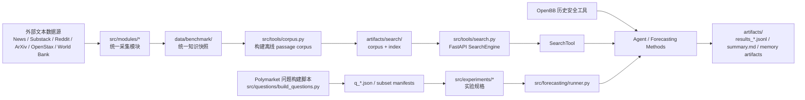

# Future Forecasting

这是一个面向“未来事件预测”研究的实验型代码库。它把数据采集、离线知识快照、本地检索、Agent 推理、记忆增强方法、实验评测和问题集构建放在同一个项目里，核心目标是研究不同 forecasting 方法在统一问题集上的效果。

项目当前主要围绕 5 类预测方法展开：

- `direct_io`：不检索，直接根据题面让模型输出概率。
- `naive_rag`：先检索，再把证据拼到 prompt 里一次性预测。
- `agentic_nomem`：Agent + 工具调用，但没有记忆增强。
- `reasoningbank`：把过往题目的经验提炼成扁平记忆项，再注入给 Agent。
- `flex`：把过往经验蒸馏成 `strategy / pattern / case` 三层经验库，并支持运行时检索。

## 项目想解决什么问题

这个仓库把 forecasting 任务拆成了四个相互独立但可以串联的层：

1. 数据层：从新闻、Substack、Reddit、ArXiv、OpenStax、World Bank 抓取文本，统一落盘为 `TextRecord`。
2. 检索层：把快照切分成 passage，构建 BM25 / dense / hybrid 检索索引，并通过 FastAPI 暴露搜索服务。
3. 推理层：把本地搜索、OpenBB 历史市场数据、记忆检索工具交给 Agent 或直接 prompt 调用。
4. 评测层：对固定问题集批量运行方法，统计 accuracy / Brier / ECE / latency / token usage 等指标。

## 总体架构



## 端到端执行链路

### 1. 构建知识快照

运行 `src/cli.py run ...` 后：

- `core.runner` 会根据模块注册表选择模块；
- 每个模块把原始抓取结果转换成统一 `TextRecord`；
- 输出落在 `data/benchmark/<snapshot_id>/.../records.jsonl`；
- `_meta` 里会写运行 manifest 和统计；
- `_state` 里会写 resume 状态；
- `_work` 里保留模块运行时文件，例如 GDELT 原始文件、URL 池数据库、harvest 中间结果等。

### 2. 构建本地检索

运行 `src/cli.py search build-corpus/build-index/serve` 后：

- `tools.corpus` 把 snapshot 中的 `records.jsonl` 切成 passage；
- `tools.search` 负责 BM25 索引、dense 向量索引、hybrid 融合与可选 reranker；
- FastAPI 服务提供 `/health` 和 `/search`；
- Agent 与实验运行时通过 `SearchClient` 访问这个服务。

### 3. 跑 forecasting 实验

运行 `src/cli.py experiment run --id ...` 后：

- `experiments.experiment` 生成 `ExperimentSpec`；
- `forecasting.runner` 载入固定题集；
- 创建 LLM、搜索客户端、方法运行上下文；
- 对每个方法逐题运行并写 `results_<method>.jsonl`；
- 汇总到 `summary.md`。

### 4. 记忆增强如何工作

- `ReasoningBank`：对每题运行轨迹做事后提炼，生成 1-3 条扁平 `MemoryItem`，后续题目按 embedding 相似度召回。
- `FLEX`：把一次运行蒸馏成 `strategy / pattern / case` 三层 `FlexExperience`，区分 `golden` 与 `warning` 两个 zone，并按时间激活，避免未来信息泄漏。

## 关键设计点

### 统一数据格式

项目内部所有文本快照最终都会被标准化为 `core.contracts.TextRecord`：

- `id`：稳定哈希 ID
- `kind`：`info` 或 `kb`
- `source`：如 `news/cnn.com`、`paper/arxiv`、`book/openstax`
- `timestamp`：`YYYY-MM-DD`
- `url`
- `payload`：真正的内容字段

这让采集模块和搜索/实验模块解耦。

### 时间截断与防泄漏

项目在多个层面控制 cutoff：

- 搜索服务按 `timestamp <= cuttime` 过滤。
- `SearchTool` 运行时自动带入当前题目的 `cuttime`。
- `OpenBBTool` 会把 `end_date` 截断到当前 cutoff。
- `forecasting.runner` 会按 `resolve_time / open_time / market_id` 排序题目。
- `FlexLibrary` 只激活 `source_resolved_time <= 当前题目 open/sample time` 的经验。

这套约束是整个实验可信度的关键。

### 搜索后端

当前支持两种搜索后端：

- `local`：本地 corpus + BM25 / dense / hybrid。
- `exa`：通过 Exa API 做外部检索，接口保持和本地搜索兼容。

### CLI 是统一入口

`src/cli.py` 提供四类入口：

- `run`：构建数据快照。
- `search`：构建/启动本地搜索服务。
- `agent`：启动带搜索和 OpenBB 工具的交互 Agent。
- `experiment`：列出并运行 forecasting 实验。

## 环境准备

### Python 和依赖

- Python：`>= 3.10`
- 包管理：推荐 `uv`

安装依赖：

```bash
uv sync
```

如果你要跑新闻抓取，建议额外准备 Playwright 浏览器：

```bash
uv run playwright install chromium
```

### 关键环境变量

项目兼容多套历史命名，最常用的是下面这些：

#### LLM

- `MODEL_NAME`
- `V_API_BASE_URL`
- `V_API_KEY`

兼容别名：

- 模型：`QWEN_MODEL` / `LLM_MODEL` / `OPENAI_MODEL`
- Base URL：`QWEN_MODEL_SERVER` / `OPENAI_BASE_URL` / `BASE_URL` / `LLM_BASE_URL`
- API Key：`QWEN_API_KEY` / `DASHSCOPE_API_KEY` / `OPENAI_API_KEY` / `API_KEY` / `LLM_API_KEY`

#### 搜索

- `SEARCH_API_BASE`
- `SEARCH_RETRIEVAL_MODE`
- `SEARCH_BACKEND`
- `EXA_API_KEY`：仅 `exa` 后端需要

#### OpenBB / 市场数据

- `TIINGO_API_KEY`
- `FMP_API_KEY`
- `FRED_API_KEY`

#### 代理

- `BRIGHT_PROXY_USERNAME`
- `BRIGHT_PROXY_PASSWORD`

## 快速开始

### 1. 构建一个 snapshot

```bash
uv run python src/cli.py run \
  --snapshot s2026_03 \
  --from 2025-12-01 \
  --to 2025-12-31 \
  --modules all
```

常用参数：

- `--resume`：按模块 state 继续跑。
- `--kb-from / --kb-to`：给知识库模块单独指定时间窗。
- `--module-workers`：模块级并发。

### 2. 从 snapshot 构建本地搜索

```bash
uv run python src/cli.py search build-corpus \
  --snapshot-root data/benchmark/s2026_03

uv run python src/cli.py search build-index \
  --snapshot-root data/benchmark/s2026_03 \
  --search-retrieval-mode hybrid
```

如果只想跑 BM25：

```bash
uv run python src/cli.py search build-index \
  --snapshot-root data/benchmark/s2026_03 \
  --search-retrieval-mode bm25
```

### 3. 启动本地搜索服务

```bash
uv run python src/cli.py search serve \
  --snapshot-root data/benchmark/s2026_03 \
  --search-retrieval-mode hybrid \
  --host 127.0.0.1 \
  --port 8000
```

### 4. 运行一个实验

先列出实验：

```bash
uv run python src/cli.py experiment list
```

运行：

```bash
uv run python src/cli.py experiment run \
  --id smoke_test_30 \
  --search-retrieval-mode hybrid
```

只跑部分方法：

```bash
uv run python src/cli.py experiment run \
  --id smoke_test_30 \
  --methods direct_io,flex
```

强制重跑：

```bash
uv run python src/cli.py experiment run \
  --id smoke_test_30 \
  --force
```

### 5. 交互式 Agent

单轮：

```bash
uv run python src/cli.py agent "Will BTC exceed 150000 by 2026?"
```

交互模式：

```bash
uv run python src/cli.py agent
```

### 6. 构建问题集

```bash
uv run python src/questions/build_questions.py \
  --recent-resolve-days 180 \
  --output-dir src/questions \
  --best-effort
```

生成好的 `q_*.json` 可以再画诊断图：

```bash
uv run python src/questions/question_visualization.py \
  --input src/questions/q_20260302T072119Z.json
```

## 实验输出长什么样

一个典型实验目录是 `artifacts/<experiment_id>/`，通常包含：

- `results_<method>.jsonl`：每题一行的预测结果。
- `summary.md`：整体指标汇总。
- `reasoningbank_mem.jsonl`：ReasoningBank 记忆条目导出。
- `flex_mem.jsonl`：FLEX 经验库导出。

结果字段说明可以看 `docs/build_result_zh.md`。

## 当前实验规格

`src/experiments/experiment.py` 里定义了当前实验：

- `pre_experiment`
- `smoke_test_3`
- `smoke_test_30`
- `smoke_test_100`
- `smoke_test_100_gemini`
- `smoke_test_30_gemini`
- `smoke_test_30_qwen`
- `smoke_test_100_mem`

默认方法集合是：

- `direct_io`
- `naive_rag`
- `agentic_nomem`
- `reasoningbank`
- `flex`

## 目录与文件说明

下面按目录列出当前仓库里值得关注的文件。`__pycache__`、运行时日志、数据库、自动生成缓存没有列。

### 根目录

| 路径 | 作用 |
| --- | --- |
| `pyproject.toml` | 项目元信息和依赖定义，`uv` / `pip` 都会读它。 |
| `uv.lock` | `uv` 生成的锁文件，用于复现依赖版本。 |
| `prompt.md` | 当前 forecasting prompts 的读物版整理，便于人工查看。源码真相仍然是 `src/forecasting/prompts.py`。 |

### `config/`

| 路径 | 作用 |
| --- | --- |
| `config/settings.toml` | 全局抓取配置，包含新闻抓取并发、代理、fallback、路径、白名单媒体域名等。 |
| `config/substack_authors.toml` | Substack 作者配置表，按领域组织作者源。 |
| `config/main_content_selectors.py` | 针对特定新闻站点的正文 selector 覆盖规则。 |
| `config/proxy_pool/high_quality_proxies.json` | 代理池样例/缓存文件，供抓取模块读取。 |

### `docs/`

| 路径 | 作用 |
| --- | --- |
| `docs/build_result_zh.md` | 预测结果字段中文说明。 |
| `docs/prompts_zh.md` | 各方法 prompt 的中文说明文档。 |

### `reference_papers/`

| 路径 | 作用 |
| --- | --- |
| `reference_papers/ReasoningBank.pdf` | ReasoningBank 论文参考。 |
| `reference_papers/FLEX.pdf` | FLEX 论文参考。 |

### `src/` 顶层

| 路径 | 作用 |
| --- | --- |
| `src/__init__.py` | 包初始化和版本号。 |
| `src/main.py` | 兼容旧入口，直接转发到 `cli.main()`。 |
| `src/cli.py` | 统一 CLI 入口，是最重要的可执行脚本。 |

### `src/agent/`

| 路径 | 作用 |
| --- | --- |
| `src/agent/__init__.py` | 导出 `Agent` 与 `AgentError`。 |
| `src/agent/agent.py` | 对 `qwen_agent` 的轻量封装，负责工具调用、usage 记录、最终消息提取。 |
| `src/agent/tools.py` | Agent 可用工具：`SearchTool`、`OpenBBTool`，以及默认工具组装逻辑。 |

### `src/core/`

| 路径 | 作用 |
| --- | --- |
| `src/core/__init__.py` | 包标记文件。 |
| `src/core/contracts.py` | 定义统一 `TextRecord` 结构和稳定 ID 生成函数。 |
| `src/core/io.py` | 定义 benchmark snapshot 的目录结构，以及 JSONL append 等 I/O。 |
| `src/core/state.py` | 每个模块的 resume 状态管理。 |
| `src/core/runner.py` | snapshot 运行器，调度模块、处理并发、写 manifest 和 stats。 |

### `src/experiments/`

| 路径 | 作用 |
| --- | --- |
| `src/experiments/__init__.py` | 通过反射发现所有 `build_*` 实验函数。 |
| `src/experiments/base.py` | `ExperimentSpec` 数据类定义。 |
| `src/experiments/experiment.py` | 当前实验规格中心，定义数据集、方法、输出目录和方法配置。 |

### `src/forecasting/`

| 路径 | 作用 |
| --- | --- |
| `src/forecasting/__init__.py` | 对外导出 forecasting 侧的常用能力。 |
| `src/forecasting/contracts.py` | forecasting 运行时核心协议：问题、结果、方法、会话、artifact。 |
| `src/forecasting/runner.py` | 执行实验规格、逐方法落盘结果、更新 summary。 |
| `src/forecasting/registry.py` | 方法注册表与别名解析。 |
| `src/forecasting/evaluation.py` | accuracy / Brier / ECE 计算与 summary 渲染。 |
| `src/forecasting/llm.py` | OpenAI 兼容聊天模型封装。 |
| `src/forecasting/prompts.py` | 所有 forecasting prompts 的单一事实来源。 |
| `src/forecasting/memory.py` | ReasoningBank 和 FLEX 的内存结构与检索/合并逻辑。 |
| `src/forecasting/embeddings.py` | 给记忆库用的 HuggingFace embedding 封装。 |
| `src/forecasting/question_tools.py` | 题级工具辅助，包含常驻 code interpreter 和 FLEX memory tool。 |

### `src/forecasting/datasets/`

| 路径 | 作用 |
| --- | --- |
| `src/forecasting/datasets/__init__.py` | 导出问题加载与子集选择函数。 |
| `src/forecasting/datasets/questions.py` | 从 `q_*.json` 加载问题池，并做平衡子集抽样。 |
| `src/forecasting/datasets/fixed_subset.py` | 加载固定 manifest 形式的题目子集。 |

### `src/forecasting/methods/`

| 路径 | 作用 |
| --- | --- |
| `src/forecasting/methods/__init__.py` | 聚合导出所有 forecasting 方法。 |
| `src/forecasting/methods/_shared.py` | 方法公共辅助：配置转换、结果构造、JSON 容错解析、cutoff 计算。 |
| `src/forecasting/methods/_agentic.py` | `direct_io` / `naive_rag` / agentic 方法共享运行逻辑。 |
| `src/forecasting/methods/direct_io.py` | 直接根据题面预测的 baseline。 |
| `src/forecasting/methods/bm25_rag.py` | `naive_rag` 实现，支持根据搜索后端自动显示为 `dense_rag` / `hybrid_rag` / `exa_rag`。 |
| `src/forecasting/methods/agentic_nomem.py` | 无记忆版 Agent 方法。 |
| `src/forecasting/methods/reasoningbank.py` | ReasoningBank 方法，注入扁平记忆并把轨迹蒸馏回记忆池。 |
| `src/forecasting/methods/flex.py` | FLEX 方法，预加载分层经验库并支持运行时记忆检索。 |

### `src/modules/`

| 路径 | 作用 |
| --- | --- |
| `src/modules/__init__.py` | 模块注册表，定义默认采集模块集合。 |
| `src/modules/base.py` | 采集模块的 `RunContext` 和 `TextModule` 协议。 |

### `src/modules/common/`

| 路径 | 作用 |
| --- | --- |
| `src/modules/common/__init__.py` | 包标记文件。 |
| `src/modules/common/crawler.py` | 新闻正文爬虫实现，支持 Scrapling 主抓 + Crawl4AI rescue + Jina fallback。 |
| `src/modules/common/extractor.py` | 通用正文提取器，负责标题/摘要/正文清洗。 |
| `src/modules/common/proxy_pool.py` | 代理池读取、环境注入、requests/crawl4ai 代理配置。 |

### `src/modules/info/`

| 路径 | 作用 |
| --- | --- |
| `src/modules/info/__init__.py` | 包标记文件。 |
| `src/modules/info/news.py` | 新闻模块总入口，串联 GDELT 下载、URL 池构建、正文爬取和统一化。 |
| `src/modules/info/substack.py` | Substack 模块入口，流式消费 importer 输出并标准化。 |
| `src/modules/info/reddit.py` | Reddit 模块，支持 PullPush + listing fallback + comments。 |
| `src/modules/info/arxiv.py` | ArXiv 模块，从官方 Atom API 拉取论文元数据。 |

### `src/modules/info/blog/`

| 路径 | 作用 |
| --- | --- |
| `src/modules/info/blog/__init__.py` | 包标记文件。 |
| `src/modules/info/blog/substack_importer.py` | Substack 增量导入器，负责 archive/feed/detail 抓取与正文清洗。 |

### `src/modules/info/news_stack/`

| 路径 | 作用 |
| --- | --- |
| `src/modules/info/news_stack/__init__.py` | 包标记文件。 |
| `src/modules/info/news_stack/news_crawler.py` | 基于 URL 池数据库的批次化新闻爬取器。 |

### `src/modules/info/news_stack/gdelt/`

| 路径 | 作用 |
| --- | --- |
| `src/modules/info/news_stack/gdelt/__init__.py` | 包标记文件。 |
| `src/modules/info/news_stack/gdelt/downloader.py` | 下载 GDELT GKG 压缩包。 |
| `src/modules/info/news_stack/gdelt/parser.py` | 解析 GKG CSV，为后续 URL 抽取做预处理。 |

### `src/modules/info/news_stack/url_pool/`

| 路径 | 作用 |
| --- | --- |
| `src/modules/info/news_stack/url_pool/__init__.py` | 包标记文件。 |
| `src/modules/info/news_stack/url_pool/builder.py` | 从 GDELT 数据抽 URL、做白名单和语言过滤，并维护 SQLite URL 池。 |

### `src/modules/kb/`

| 路径 | 作用 |
| --- | --- |
| `src/modules/kb/__init__.py` | 包标记文件。 |
| `src/modules/kb/openstax.py` | OpenStax 知识库模块，驱动独立 harvester 并流式标准化。 |
| `src/modules/kb/worldbank.py` | World Bank 报告模块，驱动 OAI/bitstream harvester 并标准化。 |

### `src/modules/kb/harvesters/`

| 路径 | 作用 |
| --- | --- |
| `src/modules/kb/harvesters/__init__.py` | 包标记文件。 |
| `src/modules/kb/harvesters/openstax_harvester.py` | OpenStax 抓取脚本，负责 catalog/detail/archive/sitemap 汇总。 |
| `src/modules/kb/harvesters/worldbank_harvester.py` | World Bank OAI harvest 脚本，负责解析元数据、下载 bitstream、维护 SQLite state。 |

### `src/tools/`

| 路径 | 作用 |
| --- | --- |
| `src/tools/__init__.py` | 包标记文件。 |
| `src/tools/search.py` | 本地搜索服务核心：corpus、BM25、dense、hybrid、rerank、FastAPI。 |
| `src/tools/search_clients.py` | 本地搜索与 Exa 搜索客户端工厂。 |
| `src/tools/corpus.py` | 从 snapshot 生成离线 passage corpus。 |
| `src/tools/bm25.py` | 轻量 BM25 工具实现，主要给检索/记忆侧共用。 |
| `src/tools/dense_embeddings.py` | 本地搜索用 dense embedding 封装。 |
| `src/tools/rerankers.py` | 第二阶段 reranker 封装。 |
| `src/tools/exa_search.py` | Exa 检索后端适配器。 |
| `src/tools/openbb.py` | OpenBB 函数白名单、调用、安全裁剪、缓存与 provider 处理。 |

### `src/utils/`

| 路径 | 作用 |
| --- | --- |
| `src/utils/__init__.py` | 包标记文件。 |
| `src/utils/config.py` | 读取 TOML / dict 配置的统一封装。 |
| `src/utils/env.py` | `.env` 加载与环境变量别名读取。 |
| `src/utils/importer_base.py` | 各类 importer 的 HTTP/session 基类。 |
| `src/utils/logger.py` | 控制台、文件、trace JSONL 日志配置。 |
| `src/utils/models.py` | 原始采集记录 `Record` 数据类。 |
| `src/utils/time_utils.py` | UTC 时间解析与标准化工具。 |

### `src/questions/`

| 路径 | 作用 |
| --- | --- |
| `src/questions/build_questions.py` | 从 Polymarket API 构建已解析的二分类问题池。 |
| `src/questions/question_visualization.py` | 对问题集画 domain / difficulty / resolve time / horizon 覆盖图。 |
| `src/questions/q_20260228T181359Z.json` | 历史生成的问题集快照。 |
| `src/questions/q_20260301T130702Z.json` | 历史生成的问题集快照。 |
| `src/questions/q_20260302T054513Z.json` | 历史生成的问题集快照。 |
| `src/questions/q_20260302T072119Z.json` | 当前固定子集常引用的源问题池。 |
| `src/questions/q_difficult_dist_20260302T072713Z.png` | 难度分布图。 |
| `src/questions/q_domain_dist_20260302T072713Z.png` | 领域分布图。 |
| `src/questions/q_horizon_validity_20260302T072713Z.png` | horizon 覆盖情况图。 |
| `src/questions/q_resolve_time_dist_20260302T072713Z.png` | resolve time 分布图。 |
| `src/questions/subsets/pre_exp_fixed_30.json` | 手工固定的 30 题子集 manifest。 |

### `data/`

| 路径 | 作用 |
| --- | --- |
| `data/mini.zip` | 小型示例/测试快照压缩包。 |
| `data/mini/info/news/records.jsonl` | 极小新闻样例快照，用于测试或演示。 |
| `data/questions/subset_30.json` | 历史/备用 30 题子集。 |
| `data/questions/subset_100.json` | 历史/备用 100 题子集。 |
| `data/questions/subsets/pre_exp_fixed_30_resolved.json` | 当前实验常用的已排序固定 30 题子集。 |
| `data/questions/subsets/pre_exp_smoke_3_resolved.json` | 3 题 smoke 测试子集。 |

### `artifacts/`

| 路径 | 作用 |
| --- | --- |
| `artifacts/search/mini/corpus.jsonl` | `mini` 快照对应的离线检索语料。 |
| `artifacts/search/mini/stats.json` | `mini` 检索语料统计。 |
| `artifacts/smoke_test_100/results_agentic_nomem.jsonl` | `smoke_test_100` 的 agentic_nomem 结果。 |
| `artifacts/smoke_test_100/results_direct_io.jsonl` | `smoke_test_100` 的 direct_io 结果。 |
| `artifacts/smoke_test_100/results_flex.jsonl` | `smoke_test_100` 的 flex 结果。 |
| `artifacts/smoke_test_100/results_naive_rag.jsonl` | `smoke_test_100` 的 naive_rag 结果。 |
| `artifacts/smoke_test_100/results_reasoningbank.jsonl` | `smoke_test_100` 的 reasoningbank 结果。 |
| `artifacts/smoke_test_100/reasoningbank_mem.jsonl` | `smoke_test_100` 的 ReasoningBank 记忆导出。 |
| `artifacts/smoke_test_100/flex_mem.jsonl` | `smoke_test_100` 的 FLEX 经验库导出。 |
| `artifacts/smoke_test_100/summary.md` | `smoke_test_100` 汇总报告。 |
| `artifacts/smoke_test_100_mem/results_reasoningbank.jsonl` | memory 相关 smoke 结果。 |
| `artifacts/smoke_test_100_mem/reasoningbank_mem.jsonl` | memory 相关 smoke 的记忆导出。 |
| `artifacts/smoke_test_100_mem/summary.md` | memory 相关 smoke 汇总。 |
| `artifacts/smoke_test_100_mem_0326/results_reasoningbank.jsonl` | 某次时间戳版本实验结果。 |
| `artifacts/smoke_test_100_mem_0326/reasoningbank_mem.jsonl` | 某次时间戳版本记忆导出。 |
| `artifacts/smoke_test_100_mem_0326/summary.md` | 某次时间戳版本汇总。 |
| `artifacts/smoke_test_30/results_agentic_nomem.jsonl` | `smoke_test_30` 的 agentic_nomem 结果。 |
| `artifacts/smoke_test_30/results_bm25_rag.jsonl` | `smoke_test_30` 的旧命名 RAG 结果。 |
| `artifacts/smoke_test_30/results_direct_io.jsonl` | `smoke_test_30` 的 direct_io 结果。 |
| `artifacts/smoke_test_30/results_flex.jsonl` | `smoke_test_30` 的 flex 结果。 |
| `artifacts/smoke_test_30/results_reasoningbank.jsonl` | `smoke_test_30` 的 reasoningbank 结果。 |
| `artifacts/smoke_test_30/reasoningbank_mem.jsonl` | `smoke_test_30` 的 ReasoningBank 记忆导出。 |
| `artifacts/smoke_test_30/flex_mem.jsonl` | `smoke_test_30` 的 FLEX 经验导出。 |
| `artifacts/smoke_test_30/summary.md` | `smoke_test_30` 汇总。 |
| `artifacts/smoke_test_30_gemini/results_reasoningbank.jsonl` | Gemini 相关实验结果。 |
| `artifacts/smoke_test_30_gemini/results_flex.jsonl` | Gemini 相关实验结果。 |
| `artifacts/smoke_test_30_gemini/reasoningbank_mem.jsonl` | Gemini 相关记忆导出。 |
| `artifacts/smoke_test_30_gemini/flex_mem.jsonl` | Gemini 相关经验导出。 |
| `artifacts/smoke_test_30_gemini/summary.md` | Gemini 相关实验汇总。 |
| `artifacts/smoke_test_30_new/results_agentic_nomem.jsonl` | 新版本 smoke 结果。 |
| `artifacts/smoke_test_30_new/results_bm25_rag.jsonl` | 新版本 smoke 的 RAG 结果。 |
| `artifacts/smoke_test_30_new/results_direct_io.jsonl` | 新版本 smoke 的 direct_io 结果。 |
| `artifacts/smoke_test_30_new/results_flex.jsonl` | 新版本 smoke 的 flex 结果。 |
| `artifacts/smoke_test_30_new/results_reasoningbank.jsonl` | 新版本 smoke 的 reasoningbank 结果。 |
| `artifacts/smoke_test_30_new/reasoningbank_mem.jsonl` | 新版本 smoke 的记忆导出。 |
| `artifacts/smoke_test_30_new/flex_mem.jsonl` | 新版本 smoke 的经验导出。 |
| `artifacts/smoke_test_30_new/summary.md` | 新版本 smoke 汇总。 |
| `artifacts/smoke_test_30_qwen/results_reasoningbank.jsonl` | Qwen 相关实验结果。 |
| `artifacts/smoke_test_30_qwen/results_flex.jsonl` | Qwen 相关实验结果。 |
| `artifacts/smoke_test_30_qwen/reasoningbank_mem.jsonl` | Qwen 相关记忆导出。 |
| `artifacts/smoke_test_30_qwen/flex_mem.jsonl` | Qwen 相关经验导出。 |
| `artifacts/smoke_test_30_qwen/summary.md` | Qwen 相关实验汇总。 |

### `tests/`

| 路径 | 作用 |
| --- | --- |
| `tests/conftest.py` | 给测试加入 `src/` 到 `sys.path`。 |
| `tests/test_agent_runtime.py` | 测试 Agent cutoff 透传、agentic 结果抽取与工具轨迹格式化。 |
| `tests/test_embeddings_cache.py` | 测试 embedding builder 的缓存与 CUDA 回退逻辑。 |
| `tests/test_env_and_cli.py` | 测试 `.env` 加载、CLI 参数解析和实验/search 命令辅助函数。 |
| `tests/test_exa_search.py` | 测试 Exa 搜索后端适配。 |
| `tests/test_experiment_registry.py` | 测试实验注册表和 spec 构建。 |
| `tests/test_fixed_question_subset.py` | 测试固定子集 manifest 加载结果。 |
| `tests/test_forecasting_runner.py` | 测试实验运行器落盘与执行顺序。 |
| `tests/test_method_registry.py` | 测试 forecasting 方法注册表与别名。 |
| `tests/test_method_sessions.py` | 测试 ReasoningBank / FLEX session 的时序与跨题记忆行为。 |
| `tests/test_openbb_support.py` | 测试 OpenBB 函数白名单、缓存、provider 和限流回退。 |
| `tests/test_pre_exp_calibration.py` | 测试 ECE 计算。 |
| `tests/test_pre_exp_memory.py` | 测试记忆库检索、合并、artifact 导出。 |
| `tests/test_pre_exp_questions.py` | 测试问题子集抽样的平衡性与确定性。 |
| `tests/test_pre_exp_run.py` | 测试预实验 spec 的默认配置。 |
| `tests/test_pre_exp_tools.py` | 测试 SearchTool、ResidentCodeInterpreterTool、本地 search engine 行为。 |
| `tests/test_search_backend.py` | 测试 search corpus/index/filter/rerank/FastAPI 行为。 |

## 运行产物目录约定

### `data/benchmark/<snapshot_id>/`

典型结构：

```text
data/benchmark/<snapshot_id>/
├── info/
│   ├── news/records.jsonl
│   ├── blog/substack/records.jsonl
│   ├── sociomedia/reddit/records.jsonl
│   └── paper/arxiv/records.jsonl
├── kb/
│   ├── book/openstax/records.jsonl
│   └── report/world_bank/records.jsonl
├── _meta/
│   ├── run_manifest.json
│   └── stats.json
├── _state/
│   └── <module>.json
└── _work/
    └── <module>/...
```

### `artifacts/search/<snapshot_id>/`

典型结构：

```text
artifacts/search/<snapshot_id>/
├── corpus.jsonl
├── stats.json
├── bm25/
├── dense/
└── logs/
```

## 如何跑测试

全量测试：

```bash
uv run pytest -q
```

只跑 forecasting / search 相关测试：

```bash
uv run pytest -q \
  tests/test_method_registry.py \
  tests/test_method_sessions.py \
  tests/test_pre_exp_memory.py \
  tests/test_pre_exp_tools.py \
  tests/test_search_backend.py
```

只验证 CLI/实验配置：

```bash
uv run pytest -q \
  tests/test_env_and_cli.py \
  tests/test_experiment_registry.py \
  tests/test_pre_exp_run.py
```

## 建议的阅读顺序

如果你第一次看这个项目，建议按下面顺序读：

1. `src/cli.py`
2. `src/core/runner.py`
3. `src/modules/__init__.py` 和各采集模块
4. `src/tools/search.py`
5. `src/forecasting/runner.py`
6. `src/forecasting/methods/_agentic.py`
7. `src/forecasting/methods/reasoningbank.py`
8. `src/forecasting/methods/flex.py`
9. `src/forecasting/prompts.py`
10. `tests/` 里对应的测试

## 适合继续改进的点

从当前代码状态看，后续最值得继续做的方向有：

- 把 `README` 里的命令进一步做成 `Makefile` 或 task runner。
- 给 snapshot、search、experiment 三层加更明确的 schema/version 标识。
- 把问题集构建脚本和实验脚本拆成更稳定的 package API。
- 补更系统的 benchmark 说明，包括模型、provider、成本和运行时配置。

